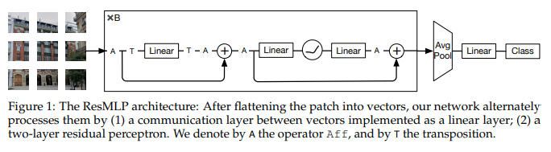

</img>

## ResMLP - Pytorch

Implementation of <a href="https://arxiv.org/abs/2105.03404">ResMLP</a>, an all MLP solution to image classification out of Facebook AI, in Pytorch

## Install

```bash
$ pip install res-mlp-pytorch
```

## Usage

```python
import torch
from res_mlp_pytorch import ResMLP

model = ResMLP(
    image_size = 256,
    patch_size = 16,
    dim = 512,
    depth = 12,
    num_classes = 1000
)

img = torch.randn(1, 3, 256, 256)
pred = model(img) # (1, 1000)
```

## Citations

```bibtex
@misc{touvron2021resmlp,
    title   = {ResMLP: Feedforward networks for image classification with data-efficient training}, 
    author  = {Hugo Touvron and Piotr Bojanowski and Mathilde Caron and Matthieu Cord and Alaaeldin El-Nouby and Edouard Grave and Armand Joulin and Gabriel Synnaeve and Jakob Verbeek and Hervé Jégou},
    year    = {2021},
    eprint  = {2105.03404},
    archivePrefix = {arXiv},
    primaryClass = {cs.CV}
}
```
